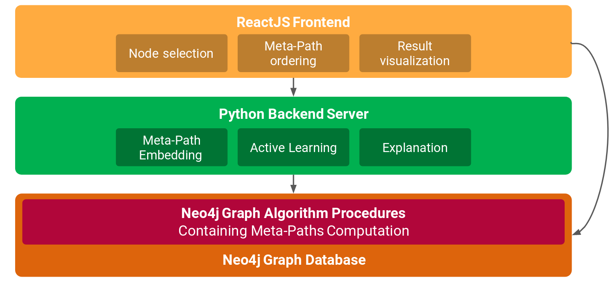

# MetaExp: Interactive Explanation and Exploration of Large Knowledge Graphs

## TODO Picture

## Motivation

We present MetaExp, a system that assists the user during the
exploration of large knowledge graphs, given two sets of initial
nodes. At its core, MetaExp presents a small set of meta-paths to the
user, which are sequences of relationships among node types. Such
meta-paths do not overwhelm the user with complex structures, yet
they preserve semantically-rich relationships in a graph. MetaExp
engages the user in an interactive procedure, which involves simple
meta-paths evaluations to infer a user-specific similarity measure.

More information can be found in the [paper](resources/paper.pdf), [slides](resources/presentation.pdf) and the [poster](resources/poster.pdf).

## TODO  Deployment

### Requirements
Our deployment is based on several docker containers, please install docker: [Mac](https://docs.docker.com/docker-for-mac/install/), 
[Windows](https://docs.docker.com/docker-for-windows/install/) and 
[Ubuntu](https://docs.docker.com/engine/installation/linux/docker-ce/ubuntu/).

### Graph Database
A - Neo4j is already running
B - New Neo4j Instance
 mvn clean install
 kopiert in plugins ordner
### Python
- start sockercontainer
- redis server deployen
- test_import route callen
### UI
To build your own local code use `deployment/build-ui.sh /path/to/code` (e.g. `deployment/build-ui.sh .`), 
set the environment variable `REACT_APP_API_HOST` according to you API (e.g. export `REACT_APP_API_HOST=[API Endpoint]`) and 
to run a single container `deployment/run-ui.sh [PORT]` (e.g. ./deployment/run-dev-ui.sh).

## System Architecture

small description

### [ReactJS UI](https://github.com/MetaExp/frontend)

Cross-Browser Usablity: Use Mozilla Firefox. Input range slider-thumb styling only works with Firefox
Architectural Approach: [Flux-Pattern](https://facebook.github.io/flux/docs/in-depth-overview.html#content)

Following, according to the Flux-Pattern, we describe the API-Communication, the most important stores and components and to which stores, i.e. data changes, they listen to and which actions they trigger.

#### API-Communication

- `/src/utils/MetaPathAPI.js` holds all relevant actions regarding API-Communication
- Actions provided according to each component's functionality
- `process.env.REACT_APP_API_HOST` React env-variable holds API-Endpoint

#### Stores

- AccountStore: Stores data regarding login information, e.g. username, chosen dataset, login state
- AppStore: Navigation data, like current page and previous and next page (footer navigation)
- SetupStore: Data of setup page, i.e. chosen node sets, cypher queries for neo4j graph visualization through forked third party [neo4j-graph-renderer](https://github.com/jbitton/neo4j-graph-renderer/pull/7)
- ExploreStore: Meta-Paths and rating information, chosen rating interface, batch size
- ResultStore: Holds explanatory data as a similarity score, top-k contributing meta-paths and additional meta-path information

#### Components

Main Parts: Setup page, Explore page, Result page

**Setup Page:**

-

**Explore Page:**

-

**Result Page:**

-

### [Python Flask API and Algorithmic Backend](https://github.com/MetaExp/backend)
- routennamen, methode, input, output, purpose
- generelles ablaufdiagram
- python komponenten

### [Neo4j Graph Algorithms](https://github.com/MetaExp/neo4j-graph-algorithms)
- hinzugefügte procedures, input output, purpose

## Contributors
Freya Behrens, Sebastian Bischoff, Pius Ladenburger, Julius Rückin, Laurenz Seidel, Fabian Stolp, Michael Vaichenker and Adrian Ziegler.

## Acknowledgments
This work was conducted with our project partners [neo4j](https://neo4j.com), [helmholz zentrum münchen](https://www.helmholtz-muenchen.de/) and [knowing health](https://knowing-health.com/).

## License
All work is licensed under [MIT License](LICENSE.md).
